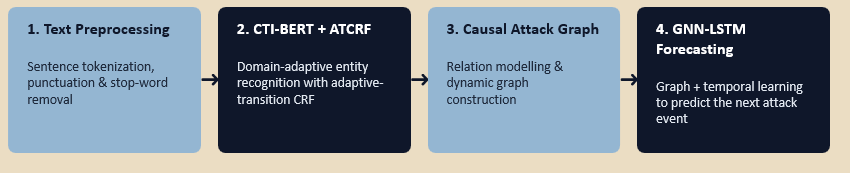

# AI-Powered Cyber Threat Intelligence Analysis from CTI Reports using CTI-BERT, GNN and LSTM

<p align="center">
  
</p>

<p align="center">


</p>

---

# Overview

Cyber Threat Intelligence (CTI) reports contain valuable information regarding cyber attacks, threat actors, malware, attack techniques, tools, vulnerabilities, and campaigns. However, these reports are written in unstructured natural language, making manual threat analysis both time-consuming and error-prone.

**CTI-ThreatLens** is an end-to-end Artificial Intelligence framework that automatically transforms unstructured CTI reports into structured cyber threat intelligence.

The framework integrates **Natural Language Processing, Knowledge Graph Construction, Graph Neural Networks, and Deep Learning-based Forecasting** to identify attack patterns and predict future attack stages.

> 🎓 Developed as part of my **M.Tech in Artificial Intelligence** research and presented at **CLICK 2026**.

---

# Project Objectives

- Automate Cyber Threat Intelligence analysis
- Extract cybersecurity entities from CTI reports
- Build dynamic knowledge graphs
- Generate attack graphs representing attack progression
- Learn graph representations using Graph Neural Networks
- Forecast probable future attack stages using LSTM
- Assist cybersecurity analysts in proactive threat mitigation

---

# System Architecture

```
                    Cyber Threat Reports
                              │
                              ▼
                    Text Preprocessing
                              │
                              ▼
                   CTI-BERT + CRF Model
                              │
                              ▼
                  Named Entity Recognition
                              │
                              ▼
                 Entity Linking & Extraction
                              │
                              ▼
              Knowledge Graph Construction
                              │
                              ▼
            Dynamic Attack Graph Generation
                              │
                              ▼
            Graph Neural Network Embeddings
                              │
                              ▼
               LSTM Threat Forecasting
                              │
                              ▼
            Future Attack Stage Prediction
```

---

# Key Features

- CTI-BERT fine-tuned for Cyber Threat Intelligence
- Named Entity Recognition using BERT + CRF
- Automated entity extraction from CTI reports
- Knowledge Graph generation
- Dynamic Attack Graph Construction
- Graph Neural Network-based graph learning
- LSTM-based future attack forecasting
- MITRE ATT&CK attack stage prediction
- Interactive threat analysis dashboard
- End-to-end AI pipeline for cyber threat intelligence

---

# Technologies Used

| Category | Technologies |
|-----------|--------------|
| Programming Language | Python |
| Deep Learning | PyTorch |
| NLP | Hugging Face Transformers |
| Language Model | CTI-BERT |
| Sequence Labelling | CRF |
| Graph Construction | NetworkX |
| Graph Learning | Graph Neural Networks (GNN) |
| Forecasting | LSTM |
| Visualization | Matplotlib |
| Dashboard | Streamlit |
| Evaluation | SeqEval, Scikit-learn |

---

# Workflow

### Step 1 — Data Collection

Cyber Threat Intelligence reports are collected from publicly available cybersecurity datasets.

↓

### Step 2 — Data Preprocessing

- Text cleaning
- Tokenization
- Label alignment
- Dataset preparation

↓

### Step 3 — Named Entity Recognition

Fine-tune **CTI-BERT + CRF** to identify cybersecurity entities such as:

- Threat Actors
- Malware
- Tools
- Vulnerabilities
- Campaigns
- Attack Techniques

↓

### Step 4 — Knowledge Graph Construction

Extracted entities are linked together to generate a structured Cyber Threat Knowledge Graph.

↓

### Step 5 — Dynamic Attack Graph

The knowledge graph is transformed into a dynamic attack graph representing attack progression.

↓

### Step 6 — Graph Representation Learning

Graph Neural Networks learn structural relationships between attack stages.

↓

### Step 7 — Future Threat Forecasting

LSTM predicts the most probable future attack stages using learned graph embeddings.

---

# Sample Output

## Detected Attack

```
EXECUTION
```

---

## Predicted Future Threats

| Attack Stage | Probability |
|--------------|------------:|
| Persistence | 40.6% |
| Defense Evasion | 31.7% |
| Discovery | 27.7% |

---

<p align="center">

</p>

---

# Repository Structure

```
CTI-ThreatLens/

│── README.md
│── requirements.txt
│── LICENSE
│
├── notebooks/
│     CTIBERT_NER_Training.ipynb
│
├── demo/
│     demo_graph_construction.mp4
│
├── assets/
│     pipeline.png
│     architecture.png
│     attack_graph.png
│     forecasting.png
│     dashboard.png
│     loss_curve.png
│
├── docs/
│     Project_Report.pdf
│     CLICK2026_Presentation.pdf
│
└── sample_data/
```

---

# Installation

Clone the repository

```bash
git clone https://github.com/harshitha923/CTI-BERT-Dynamic-Attack-Graph-Construction-from-CTI-Reports.git
```

Navigate into the project

```bash
cd CTI-BERT-Dynamic-Attack-Graph-Construction-from-CTI-Reports
```

Install dependencies

```bash
pip install -r requirements.txt
```

---

# Running the Project

Open the notebook

```
notebooks/CTIBERT_NER_Training.ipynb
```

Execute the notebook sequentially to:

- Load CTI datasets
- Train CTI-BERT
- Evaluate NER performance
- Generate entity predictions
- Construct attack graphs
- Forecast future cyber attack stages

---

# Research Contributions

This project presents a unified AI framework integrating:

- Transformer-based Named Entity Recognition
- Knowledge Graph Construction
- Dynamic Attack Graph Generation
- Graph Neural Networks
- Temporal Forecasting using LSTM

The proposed system enables cybersecurity analysts to move beyond attack detection by forecasting probable future attack stages, supporting proactive cyber defense.

---

# Future Enhancements

- Retrieval-Augmented Generation (RAG) for CTI analysis
- Large Language Model-assisted threat summarization
- Graph Attention Networks (GAT)
- Real-time CTI stream processing
- Explainable AI for cyber threat prediction
- Cloud deployment with REST APIs

---

# Demo

The repository includes an interactive demonstration showcasing:

- Cyber Threat Report Analysis
- Named Entity Recognition
- Knowledge Graph Generation
- Dynamic Attack Graph Visualization
- Future Attack Forecasting Dashboard

Demo video available in:

```
demo/demo_graph_construction.mp4
```

---

# Author

**Harshitha**

**M.Tech – Artificial Intelligence**

Areas of Interest

- Artificial Intelligence
- Machine Learning
- Natural Language Processing
- Cyber Threat Intelligence
- Knowledge Graphs
- Graph Neural Networks
- Large Language Models
- Generative AI

---

# Citation

If you use this work for research or academic purposes, please cite the associated conference publication.

---

# License

This project is released for **academic and research purposes**.

---

⭐ If you found this project useful, consider giving the repository a star!
